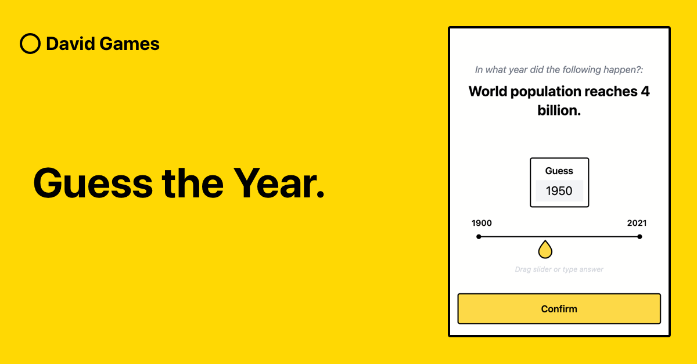

# Guess The Year Game


Made by : **David Han (@davjhan on github)**
# Try it out!
Play the game here: [`Guess The Year Game`](https://guess-the-year.davjhan.com/)

# Built with
- [`Svelte Kit`](https://kit.svelte.dev/)
- Tailwind CSS (JIT)
- Netlify

Generates a static app that is hosted on Netlify.

# Get Started

⚠️ This repo will not build by itself. It has a dependency on `davjhan-core` which is not published on npm.

`davjhan-core` includes common tailwind styles, css, and components (e.g. Navbar) that will be reused between david 
games. I use `yalc link davjhan-core` on my local machine so that it builds.

# Questions
I sourced Wikipedia to hand-compile a database of questions in Airtable. I then have a script, 
`scripts/download-questions.
ts`, that downloads the questions to a json file. It sits at 12kb for 120+ questions.

# Commands
### Run the dev server
```bash
npm run dev
```

### Download the questions.json from Airtable database
```bash
npm run download-questions
```

### Build and preview
```bash
npm run build
```
```bash
npm run preview
```
### Deploy to Netlify
```bash
npm run deploy
```